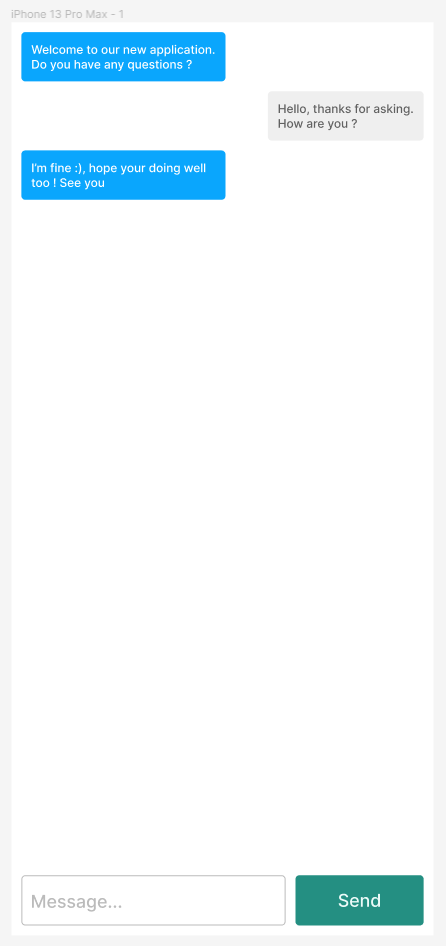

<h1 align="middle"> Webchat </h1>

## Summary

* [Overview](#Overview)
* [Rules](#Rules)
* [Requirements](#requirements)
* [Bonus](#bonus)
* [Credits](#Credits)

## Overview
Let's create a Webchat with only HTML, CSS and Javascript.

## Rules

* You **MUST** create a directory named `webchat`
* You **MUST** create a file called `.author`:
* You **MUST** return your project through [Google Drive](https://drive.google.com/drive/folders/1MT0OnqWwc2LrxJPnXWWZ30Gv7Xki5y9P?usp=sharing)
* You **MUST** create a directory `LAST_NAME FIRST_NAME` in the [Google Drive](https://drive.google.com/drive/folders/1MT0OnqWwc2LrxJPnXWWZ30Gv7Xki5y9P?usp=sharing)

```sh
~/efrei-courses/learn-javascript/exams/webchat ❯❯❯ cat -e .author
[
  {
    "firstName": "Dylan",
    "lastName": "DE SOUSA"
  }
]
```

## Requirements



### Messages
```
⚠️ You don't have to implement a real Webchat application, this is just a mock application.
```

- When you click on the `Send Button`, it has to create a new `Gray Message` with the content of the `Message Input`.

### Design-System

#### Buttons
```
Font
    - font-size: 12
Colors
    - background-color: #248F8
    - text-color: #616161
```

#### Messages
```
Font
    - font-size: 18
Colors
    - background-color: #0AA6FD OR #EFEFEF
    - text-color: #EBFAF8
```

#### Inputs
```
Font
    - font-size: 18
Colors
    - border-color: #BBBBBB
    - text-color: #BBBBBB
```

### Bonus
Feel free to add anything you want. Here are a list of some bonus that you can do,

- More information on `Messages` like the author name, the date / hours ...
- Any graphical update are welcome :)
- Real communication

## Credits

Made by **Call-Me-Dev**
